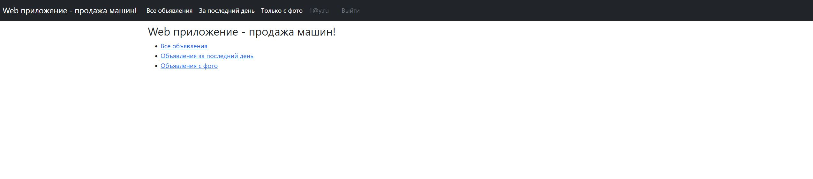
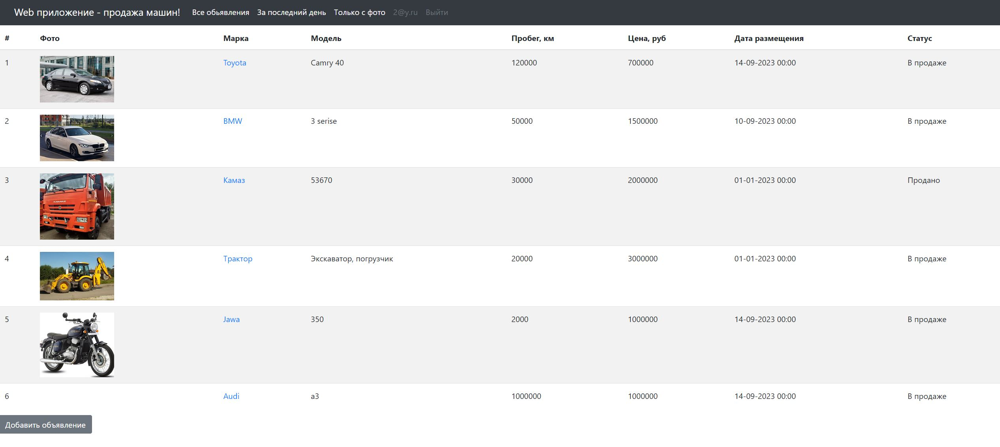
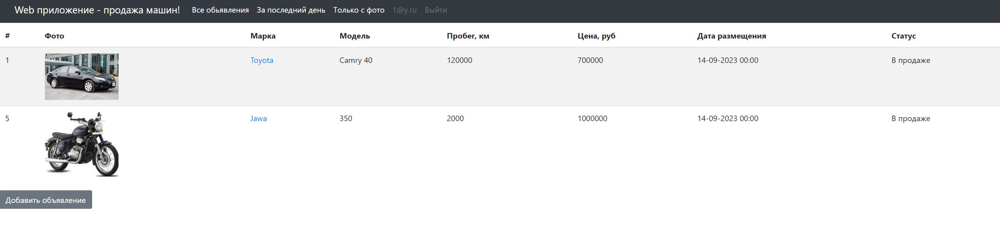
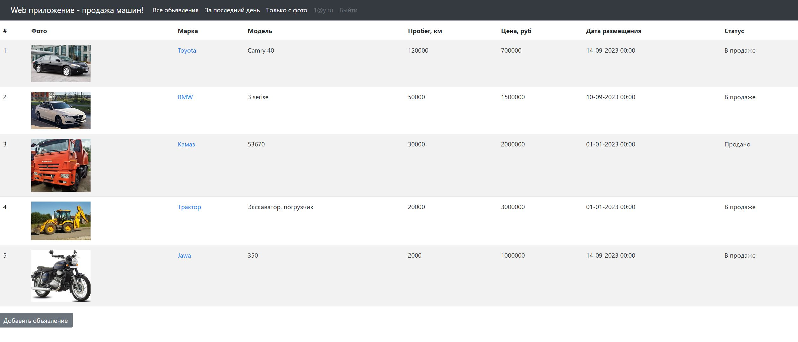
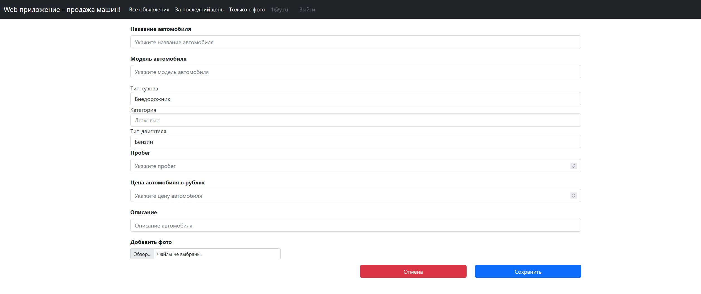
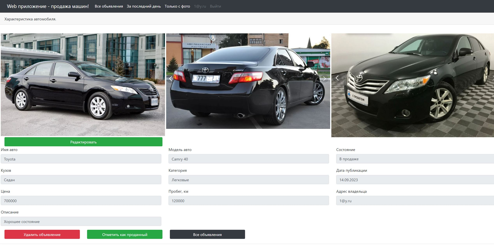
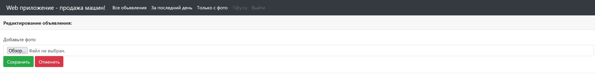
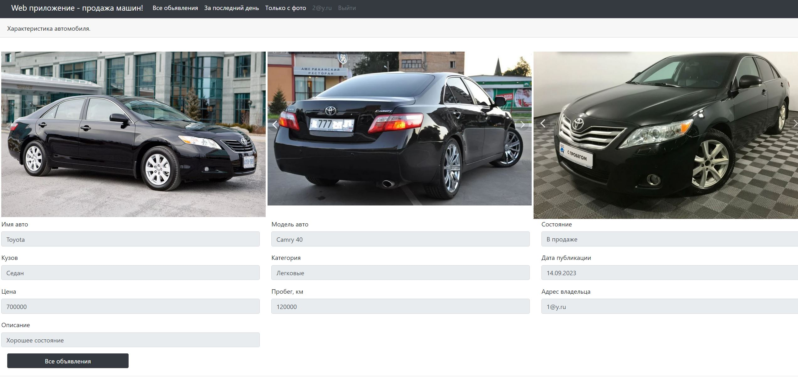

# job4j_cars

## О проекте

**Проект "АвтоМаг"**

Проект представляет собой упрощенный вариант сайта по продаже автомобилей.

Из логики реализовано:

    Страница со списком всех объявлений с возможностью отсортировать категории авто, состоянию, и другим фильтрам(За последний день, С фото, Только актуальные).
    Так же есть кнопка "Добавить объявление".
    При создании объявления можно выбрать тип кузова, тип двигателя и другие характеристики.
    Объявления можно переводить в состояние "Продано" или удалить из списка.

_Контакты для связи:_
__**kbus94@yandex.ru**__

### Для запуска необходимо:
1. [x] Java 17;
2. [x] Maven 3.8.
3. [x] PostgreSql 14.

### Стек используемых технологий:
1. Java 17;
2. PostgreSQL JDBC 42.5.4;
3. Spring boot 2.7.8;
4. Lombok 1.18.22
5. Thymeleaf 3.0.15;
6. Bootstrap v5.2.2;
7. liquibase 4.15.0;
8. Hibernate 5.6.11.Final

Перед запуском проекта необходимо создать **БД car** и указать
**_login/password_** в файле _src/main/resources/db.properties_;

### Запуск приложения:

+ Cкачать проект из этого репозитория
+ Настроить соединение с базой данных
+ Запустить проект командой
```
mvn spring-boot:run
```
### Интерфейс:

#### Форма регистрации нового пользователя.

#### Форма авторизации. Только авторизованный пользователь может создать объявление, управлять им, удалять или менять статус.

#### Начальная страница.

#### Главная страница со списком объявлений. Объявление имеет статус продано или нет. Есть кнопка добавить новое объявление. 

#### Главная страница со списком объявлений. Фильтр объявлений за последний день.

#### Главная страница со списком объявлений. Фильтр объявлений c фото.

#### Страница добавления обьявления.

#### При нажатии на название марки автомобиля на главной странице переходим на страницу с подробной информацией объявления. Кнопка *Удалить объявление* удаляет его из списка.Кнопка *Отметить как проданный* переводит бъявление в статус Продано.

#### При нажатии на *Редактирование* можем добавить фото к обьявлению. 

#### Если пользователь не является создателем объявления, то у него нет возможности управлять объявлением.
